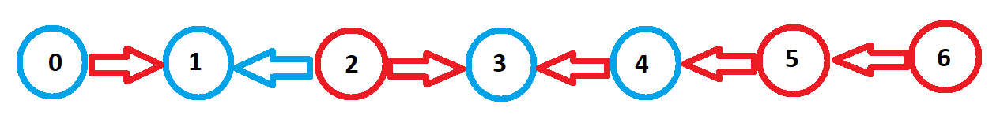

# Red-blue graph problem solver - Rust implementation

The problem is the following:

In a directed graph, each node is colored either red or blue. Furthermore, vertices are also colored red or blue.

When a node is deleted, its adjacent nodes are colored the same color as the vertex which made the link with the node.

What is the maximum uninterrupted sequence we can delete, with k nodes of all the same color ? We cannot delete any node of the other color.

### Example

Consider having the following flat graph:

The color to delete is RED, so we get the following output: [2, 3, 5, 4, 6]

If we analyze the output:

- We delete the node 2 -> node 1 stays blue and node 3 becomes red.
- We delete the node 3
- We delete the node 5 -> node 4 becomes red.
- We delete the node 4
- We delete the node 6

### Implementation

The purpose of this program is to test which Rust or C++ is the fastest to solve the problem. So I've just translated the C++ code of the [red-blue graph proglem solver 1](https://github.com/thomasarmel/red_blue_graph_solver_1) to Rust.
The algorithm has a linear complexity, bast case O(n) and worst case O(3n) = O(n).

Thanks to [Marcel](https://github.com/MarcelMARSAIS-LACOSTE) for the idea of the algorithm.

## Benchmark

Is Rust implementation faster than the C++ one  [here](https://github.com/thomasarmel/red_blue_graph_solver_1) ?

### Method

I ran the benchmark with my personal laptop. Here are the specs:
* Lenovo Ideapad 720
* CPU: 4 x Intel Core i5-8250U @ 1.60GHz (8 threads)
* Cache: 256 Ko, 1 Mo, 6 Mo
* RAM: 12 GB SO-DIMM DDR4 2400MHz
* Operating System: Windows 10 Pro
* Rust compiler: rustc 1.58.0
* C++ compiler: Microsoft Visual C++ 14 with C++ 17

I also ran tests using Ubuntu 20.04 on WSL 1 using g++ 9.3.
For Rust wasm implementation, I used Chrome 97 and Firefox 96 with the same laptop.

Each implementation has been launched 3 times, and I kept the fastest one.

I always compiled code with max performance, so I always used the `-O3` flag (release).
How much time take each implementation to generate the sequence from a secure random graph of 5 millions nodes (only sequence generation is considered, not graph creation) ?

### Results

| **Implementation**       | **Time (ms)** |
|--------------------------|---------------|
| Rust native (Windows)    | 121.421600    |
| Rust native (WSL Ubuntu) | 144.669700    |
| Rust wasm (Chrome)       | 132.000       |
| Rust wasm (Firefox)      | 151.000       |
| C++ native (Windows)     | 442.636       |
| C++ native (WSL Ubuntu)  | 338.660000    |

*(Significant digits aren't taken into account)*